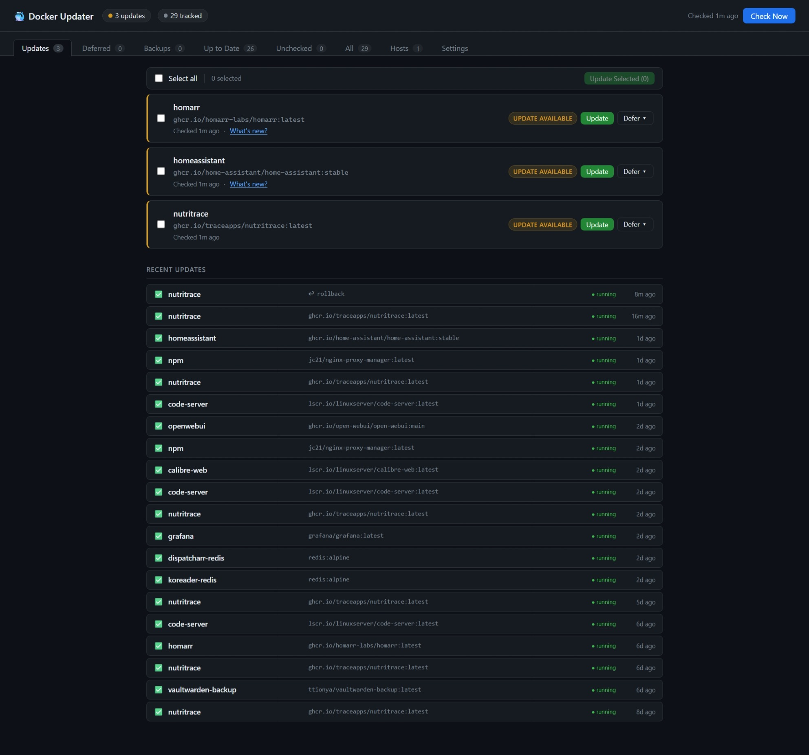
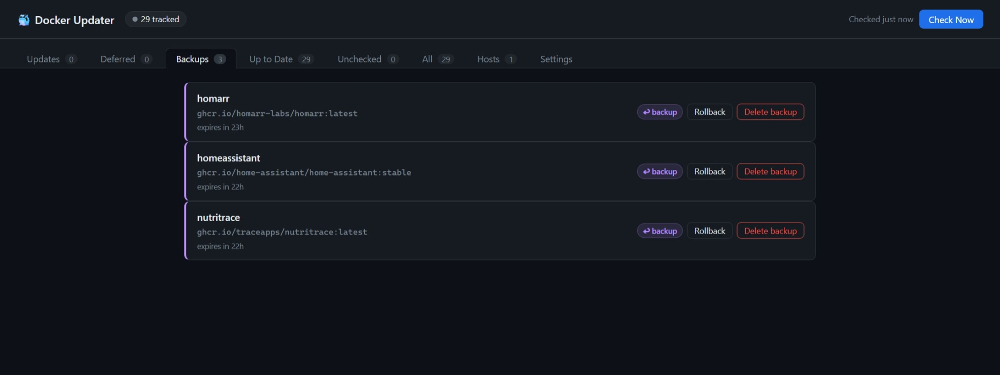
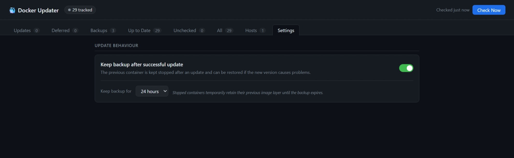
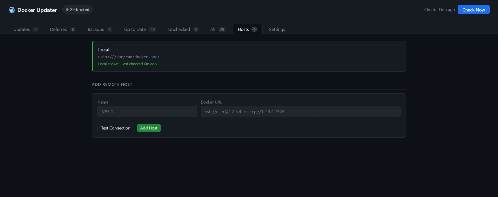

# docker-updater

A lightweight self-hosted web UI for managing Docker container updates — a manual-approval alternative to Watchtower.

Instead of automatically pulling and restarting containers the moment a new image is published, docker-updater polls your registries on a schedule, shows you what's available, and lets you decide when (or whether) to update each container. Updates are performed with a built-in rollback safety net — the old container is kept and can be automatically restored if the new one fails to start. For additional peace of mind, you can optionally retain a backup of the previous container after a *successful* update too — so you can roll back even when a new version comes up cleanly but later turns out to have problems. You can also view release changelogs from GitHub before committing to an update.

---









## Features

- **Registry polling** — compares local image digests against the registry without pulling, using the Docker Registry v2 manifest API (`HEAD` + `Docker-Content-Digest`)
- **Multi-registry support** — Docker Hub, GHCR (`ghcr.io`), LinuxServer (`lscr.io`), and any registry that implements the Bearer token challenge
- **Multi-host support** — manage containers across multiple Docker hosts (SSH or TCP) from a single dashboard; each host has a connection health indicator and containers are shown together with a host chip
- **Per-container control** — update individually, defer for 7/14/30/90 days or indefinitely, or un-defer at any time
- **Bulk updates** — select multiple containers and update them all at once
- **Changelog viewer** — fetches the last 5 GitHub Releases for any image that publishes an `org.opencontainers.image.source` label
- **Live update log** — streaming log modal shows pull progress and recreation status in real time; auto-reconnects if you refresh the page mid-update
- **Smart history icons** — recent updates show ✅ (succeeded or running & up-to-date), ⚠️ (errored but container still running), or ❌ (errored and stopped), with a `● running / ● stopped` dot for every row
- **Push notifications** — auto-generates a private ntfy topic on first run; or bring your own Apprise URL (ntfy, Pushover, Discord, Slack, etc.)
- **GitHub notifications** — optional webhook endpoint receives issue, PR, star, push, and release events from any of your repos and forwards them as push notifications
- **Scheduled checks** — cron-style daily check at a configurable time and timezone; notifications only fire on the scheduled run, not on startup or manual checks
- **Safe recreation** — recreates containers using the Python Docker SDK (Watchtower pattern), preserving all original config: volumes, ports, environment variables, networks, static IPs, restart policy, capabilities, etc.
- **Backup & rollback** — optionally keep the previous container after a successful update for a configurable window (Settings tab); roll back to it in one click if the new version misbehaves, or delete the backup early to reclaim space
- **Locally-built images skipped** — containers with no `RepoDigests` (built from local Dockerfiles) are automatically ignored
- **Persistent state** — update history, deferred decisions, and last-check timestamps survive container restarts
- **Dark UI** — tabbed dashboard: Updates / Deferred / Backups / Up to Date / Unchecked / All / Hosts / Settings

---

## Requirements

- Docker with access to `/var/run/docker.sock`
- Works on Synology DSM, Unraid, Proxmox, or any Linux host running Docker

---

## Quick start

```bash
mkdir docker-updater && cd docker-updater
mkdir -p data

docker run -d \
  --name docker-updater \
  --restart unless-stopped \
  -p 9292:9090 \
  -v /var/run/docker.sock:/var/run/docker.sock \
  -v $(pwd)/data:/app/data \
  -e CHECK_TIME=03:00 \
  -e TIMEZONE=Australia/Melbourne \
  ghcr.io/liquidguru/docker-updater:latest
```

Then open `http://<your-host>:9292`. A green banner will appear showing your auto-generated ntfy topic — subscribe to it in the ntfy app to receive push notifications.

---

## docker-compose.yml

```yaml
services:
  docker-updater:
    image: ghcr.io/liquidguru/docker-updater:latest
    container_name: docker-updater
    restart: unless-stopped
    ports:
      - "9292:9090"
    volumes:
      - /var/run/docker.sock:/var/run/docker.sock
      - ./data:/app/data
    environment:
      - CHECK_TIME=03:00
      - TIMEZONE=Australia/Melbourne
      # NOTIFY_URL is optional — if omitted, a private ntfy topic is auto-generated
      # and shown in the dashboard on first run. To use your own:
      # - NOTIFY_URL=ntfy://ntfy.sh/your-private-topic
      # - NOTIFY_URL=discord://webhookid/webhooktoken
      - DOCKER_HOST=unix:///var/run/docker.sock
```

Save as `docker-compose.yml`, create a `data/` directory alongside it, then run `docker compose up -d`. No clone required.

> **Port note:** The container listens internally on port 9090. The host binding `9292:9090` avoids clashing with Prometheus, which commonly uses 9090. Change it to whatever suits your setup.

---

## Configuration

| Environment variable | Default | Description |
|---|---|---|
| `CHECK_TIME` | `03:00` | Time of day for the scheduled digest check (HH:MM) |
| `TIMEZONE` | `Australia/Melbourne` | Timezone for the scheduled check — any [tz database name](https://en.wikipedia.org/wiki/List_of_tz_database_time_zones) |
| `NOTIFY_URL` | *(auto)* | [Apprise URL](https://github.com/caronc/apprise/wiki) for push notifications. If not set, a unique private ntfy.sh topic is generated automatically. |
| `GITHUB_WEBHOOK_SECRET` | *(empty)* | Secret for verifying GitHub webhook signatures. Required if using the GitHub notifications feature. |
| `DOCKER_HOST` | `unix:///var/run/docker.sock` | Docker socket path |

---

## Multi-host support

docker-updater can manage containers on multiple Docker hosts from a single dashboard. Click the **Hosts** tab to add remote hosts.

### Supported connection types

| URL format | Notes |
|---|---|
| `ssh://user@host` | SSH — uses your system's SSH config/keys |
| `ssh://user@host:port` | SSH on a non-standard port |
| `tcp://host:2376` | TCP — enable Docker's remote API on the remote host |

### Adding a host

1. Open the **Hosts** tab
2. Enter a name and the Docker URL
3. Click **Test Connection** to verify before saving
4. Click **Add Host** — a check runs immediately

All containers from all hosts then appear together in the Updates/Deferred/Up to Date/etc. tabs, each with a small host chip. The Hosts tab shows connection health and last-check time for each host.

---

## Push notifications

Push notifications are **only sent by the scheduled check** when updates are found. Startup scans and manual "Check Now" are always silent — so restarting the container never floods your phone.

### Auto-setup (default)

If you don't set `NOTIFY_URL`, docker-updater generates a unique private topic on first run (e.g. `ntfy.sh/du-a3f8c12b`) and saves it to `data/state.json`. A green banner appears in the dashboard with a **Copy** button — just paste that topic into the ntfy app and you're done. Dismiss the banner once you've subscribed.

> **Why unique topics?** ntfy.sh topics are public by default — anyone who knows a topic name can read its messages. docker-updater's auto-generated topics are random strings that aren't published anywhere, keeping your notifications private.

### Custom notifications

Set `NOTIFY_URL` to any [Apprise-compatible URL](https://github.com/caronc/apprise/wiki):

```
ntfy://ntfy.sh/my-private-topic
discord://webhookid/webhooktoken
slack://tokenA/tokenB/tokenC
```

---

## GitHub notifications (optional)

docker-updater can receive GitHub webhook events and forward them as push notifications — new issues, PRs, stars, pushes, and releases across all your repos.

### Setup

1. Add `GITHUB_WEBHOOK_SECRET` to your container with a random secret:
   ```bash
   openssl rand -hex 32
   ```

2. Make your docker-updater accessible from the internet (e.g. via a Cloudflare Tunnel or reverse proxy).

3. Register the webhook on each GitHub repo:
   - Go to **Settings → Webhooks → Add webhook**
   - Payload URL: `https://your-host/webhook/github`
   - Content type: `application/json`
   - Secret: the value from step 1
   - Events: choose which you want (issues, PRs, pushes, stars, releases)

   Or use the GitHub API to register across all your repos at once:
   ```bash
   TOKEN="your-github-token"
   SECRET="your-webhook-secret"
   URL="https://your-host/webhook/github"
   curl -s -X POST \
     -H "Authorization: token $TOKEN" \
     -H "Content-Type: application/json" \
     -d "{\"name\":\"web\",\"active\":true,\"events\":[\"issues\",\"pull_request\",\"watch\",\"push\",\"release\",\"issue_comment\"],\"config\":{\"url\":\"$URL\",\"content_type\":\"json\",\"secret\":\"$SECRET\"}}" \
     https://api.github.com/repos/YOUR_USERNAME/REPO_NAME/hooks
   ```

### Supported events

| Event | Notification |
|---|---|
| Issue opened | 🐛 New issue — repo |
| Issue closed | ✅ Issue closed — repo |
| PR opened | 🔀 New PR — repo |
| PR merged | ✅ PR merged — repo |
| Star | ⭐ New star — repo |
| Push to main/master | 📦 Push to main — repo |
| Release published | 🚀 New release — repo |
| Issue comment | 💬 Comment — repo |

---

## How it works

1. On startup (silently) and at the configured `CHECK_TIME`, docker-updater iterates all running containers
2. For each container it extracts the local image digest from `RepoDigests`
3. It sends a `HEAD` request to the registry for the image's manifest, reading the `Docker-Content-Digest` response header — no image data is transferred
4. If the digests differ, the container is flagged as having an update available
5. When you click **Update**, the app:
   - Pulls the new image (streaming progress to the log modal)
   - Stops the old container and renames it to `{name}_old` (kept as a rollback target)
   - Creates and starts the new container with identical config using the Docker SDK low-level API (Watchtower pattern)
   - Reconnects all networks via `NetworkConnect`, preserving static IP assignments, aliases, and iptables setup
   - Waits 2 seconds and checks the new container is still running
   - **On success**: removes the `_old` container — or, with backup retention enabled, keeps it for the configured window so you can still roll back later (see [Backup & rollback](#backup--rollback))
   - **On failure**: removes the failed new container, renames `_old` back, and restarts the previous version

Container state (update availability, defer decisions, history, backups) is persisted to `data/state.json`.

---

## Backup & rollback

docker-updater keeps a safety net around every update — at two levels.

### Automatic rollback on failure (always on)

Before recreating a container, the old one is renamed to `{name}_old`. If the new container fails to start, docker-updater removes it, renames the old one back, and restarts it. A broken update therefore can't take a service offline — the previous version is restored automatically.

### Backup retention for clean-but-broken updates (opt-in)

Sometimes a new image starts up perfectly cleanly, and only later do you discover something is actually broken — a regression, a bad release, a changed default, a dropped port. The automatic rollback above can't catch this, because as far as Docker is concerned the container came up fine.

For that extra peace of mind, enable **Keep backup after successful update** in the **Settings** tab. When it's on, the previous container is kept (stopped) after a *successful* update for a configurable window (default 24 hours) instead of being removed. If you hit a problem afterwards, open the **Backups** tab and click **Rollback** to instantly restore the previous version — even though the update "succeeded". Finished with a backup early? **Delete backup** removes it and reclaims the disk space.

Backups are self-managing: each entry is verified against its actual `_old` container, and expired or orphaned entries are cleaned up automatically — so the Backups tab always reflects what's really there.

---

## Changelog viewer

For containers whose image was built with an `org.opencontainers.image.source` label pointing to a GitHub repository, a **What's new?** link appears in the update card. Clicking it fetches the last 5 releases from the GitHub Releases API and renders them inline with basic markdown formatting.

This works out of the box for most images maintained by projects that publish GitHub Releases (Home Assistant, Homarr, Vaultwarden, Calibre-Web, and many LinuxServer images).

---

## Building from source

If you want to hack on it or run the latest uncommitted changes:

```bash
git clone https://github.com/liquidguru/docker-updater.git
cd docker-updater
mkdir -p data
docker compose up -d   # uses the build: . compose file in the repo
```

---

## Replacing Watchtower

If you have Watchtower running, stop it after confirming docker-updater is working:

```bash
docker stop watchtower
docker rm watchtower
```

---

## Caveats

- **docker compose stacks**: Updates recreate individual containers using the Docker SDK. The container's `docker-compose.yml` is not modified — if you later run `docker compose up` it will see the new image and behave correctly, but the compose file's image tag won't be changed.
- **Named volumes**: Preserved automatically — volume mounts are read from the container's `HostConfig.Binds` and reattached on recreation.
- **Locally-built images**: Any container whose image has no `RepoDigests` is skipped (these can't be compared against a registry).
- **Private registries**: Currently supports anonymous and Bearer-token registries. Basic auth (username/password) registries are not yet supported.
- **Breaking changes in new versions**: docker-updater preserves the environment variables your container was running with, but cannot detect when a new image version introduces new required environment variables. If an update fails with an application-level error after recreation, check the image's release notes for new required env vars.
- **host network mode**: Containers using `--network host` are recreated correctly; the network reconnect step is skipped for these.
- **Backup retention & disk space**: with backup retention enabled, each backup keeps a stopped container and its previous image layers until the backup expires (or you delete it from the Backups tab). On hosts with limited disk, keep the retention window short or delete backups once you're confident in an update.

---

## License

MIT
