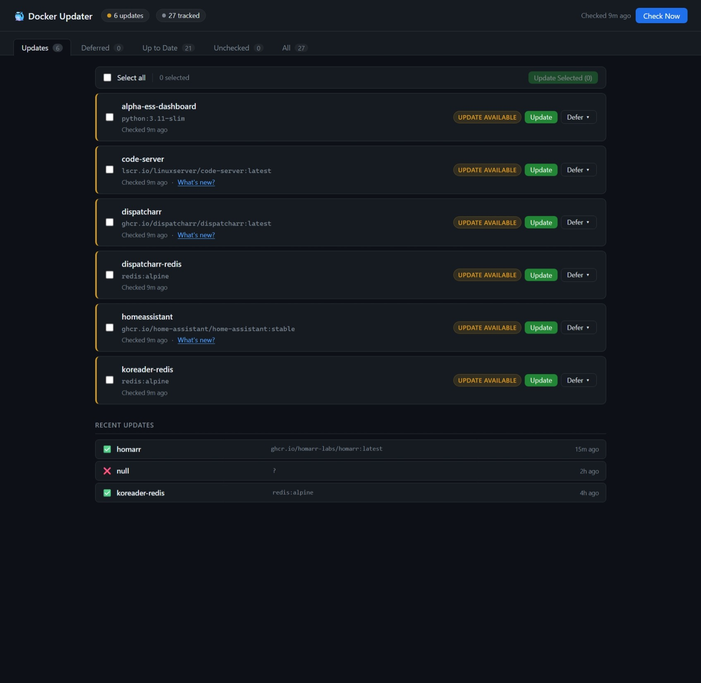

# docker-updater

A lightweight self-hosted web UI for managing Docker container updates — a manual-approval alternative to Watchtower.

Instead of automatically pulling and restarting containers the moment a new image is published, docker-updater polls your registries on a schedule, shows you what's available, and lets you decide when (or whether) to update each container. You can also view release changelogs from GitHub before committing to an update.

---



## Features

- **Registry polling** — compares local image digests against the registry without pulling, using the Docker Registry v2 manifest API (`HEAD` + `Docker-Content-Digest`)
- **Multi-registry support** — Docker Hub, GHCR (`ghcr.io`), LinuxServer (`lscr.io`), and any registry that implements the Bearer token challenge
- **Per-container control** — update individually, defer for 7/14/30/90 days or indefinitely, or un-defer at any time
- **Bulk updates** — select multiple containers and update them all at once
- **Changelog viewer** — fetches the last 5 GitHub Releases for any image that publishes an `org.opencontainers.image.source` label
- **Live update log** — streaming log modal shows pull progress and container recreation status in real time
- **Safe recreation** — recreates containers using the Python Docker SDK, preserving all original config: volumes, ports, environment variables, networks, restart policy, capabilities, etc.
- **Locally-built images skipped** — containers with no `RepoDigests` (built from local Dockerfiles) are automatically ignored
- **Persistent state** — update history, deferred decisions, and last-check timestamps survive container restarts
- **Dark UI** — tabbed dashboard: Updates / Deferred / Up to Date / Unchecked / All

---

## Requirements

- Docker with access to `/var/run/docker.sock`
- Works on Synology DSM, Unraid, Proxmox, or any Linux host running Docker
- No `docker compose` binary required — all container management is via the Python Docker SDK

---

## Quick start

```bash
# Clone the repo
git clone https://github.com/liquidguru/docker-updater.git
cd docker-updater

# Create the data directory (required before first run)
mkdir -p data

# Build and start
docker build -t docker-updater .
docker compose up -d
```

Then open `http://<your-host>:9292` in your browser.

---

## docker-compose.yml

```yaml
services:
  docker-updater:
    build: .
    container_name: docker-updater
    restart: unless-stopped
    ports:
      - "9292:9090"
    volumes:
      - /var/run/docker.sock:/var/run/docker.sock
      - ./data:/app/data
      - ./app.py:/app/app.py:ro          # optional: live-edit without rebuild
      - ./templates:/app/templates:ro    # optional: live-edit without rebuild
    environment:
      - CHECK_INTERVAL_HOURS=12
      - DOCKER_HOST=unix:///var/run/docker.sock
```

> **Port note:** The container listens internally on port 9090. The host binding `9292:9090` avoids clashing with Prometheus, which commonly uses 9090. Change the host-side port to whatever suits your setup.

---

## Configuration

| Environment variable | Default | Description |
|---|---|---|
| `CHECK_INTERVAL_HOURS` | `12` | How often to poll registries for digest changes |

A manual **Check Now** button is also available in the UI.

---

## How it works

1. On startup (and every `CHECK_INTERVAL_HOURS`), docker-updater iterates all running containers
2. For each container it extracts the local image digest from `RepoDigests`
3. It sends a `HEAD` request to the registry for the image's manifest, reading the `Docker-Content-Digest` response header — no image data is transferred
4. If the digests differ, the container is flagged as having an update available
5. When you click **Update**, the app:
   - Pulls the new image (streaming progress to the log modal)
   - Stops and removes the old container
   - Recreates it with identical config using the Docker SDK low-level API
   - Starts the new container

Container state (update availability, defer decisions, history) is persisted to `data/state.json`.

---

## Changelog viewer

For containers whose image was built with an `org.opencontainers.image.source` label pointing to a GitHub repository, a **What's new?** link appears in the update card. Clicking it fetches the last 5 releases from the GitHub Releases API and renders them inline with basic markdown formatting.

This works out of the box for most images maintained by projects that publish GitHub Releases (Home Assistant, Homarr, Vaultwarden, Calibre-Web, and many LinuxServer images).

---

## Replacing Watchtower

If you have Watchtower running, stop it after confirming docker-updater is working:

```bash
docker stop watchtower
docker rm watchtower
```

---

## Caveats

- **docker compose stacks**: Updates recreate individual containers using the Docker SDK. The container's `docker-compose.yml` is not modified — if you later run `docker compose up` it will see the new image and behave correctly, but the compose file's image tag won't be changed.
- **Named volumes**: Preserved automatically — volume mounts are read from the container's `HostConfig.Binds` and reattached on recreation.
- **Locally-built images**: Any container whose image has no `RepoDigests` is skipped (these can't be compared against a registry).
- **Private registries**: Currently supports anonymous and Bearer-token registries. Basic auth (username/password) registries are not yet supported.

---

## License

MIT
